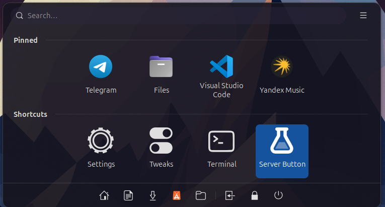
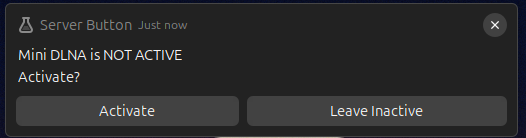
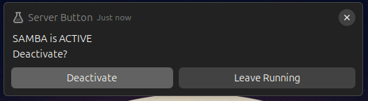
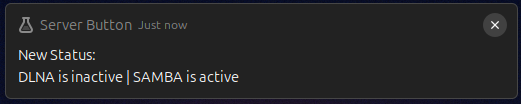

# Server Button

A simple bash script to control Mini DLNA and Samba services via notifications.

## Features

- Toggle Mini DLNA service on/off
- Toggle Samba service on/off
- Provides visual notifications with status updates

## Requirements

- `notify-send` (for desktop notifications)
- `systemctl` (for service management)
- Mini DLNA service (`minidlna`)
- Samba service (`smbd`)

## Usage

1. Make the script executable:
   ```bash
   chmod +x server_button.sh
   ```

2. Run the script:
   ```bash
   ./server_button.sh
   ```

3. Use the notification buttons to control the services.

## Examples









## Notes

- I use [ArcMenu](https://github.com/arcmenu/ArcMenu) to launch the script.
- You will be prompted for your sudo password when toggling services.

- The script uses a custom icon path (`/home/cass/Pictures/applications-science-symbolic.svg`). Update this path to match your icon location.
- The script checks the status of both services and provides a summary notification after changes.

## Credits

Icon by [ZorinOS](https://github.com/ZorinOS/zorin-icon-themes)